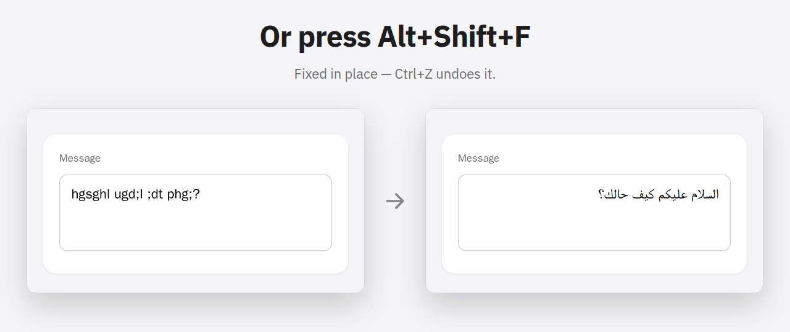
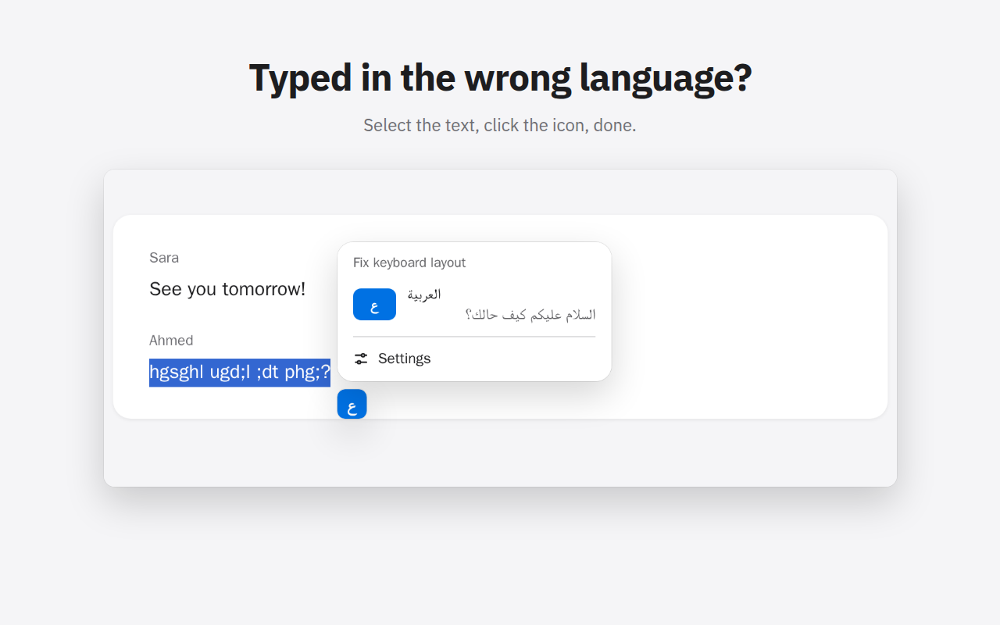
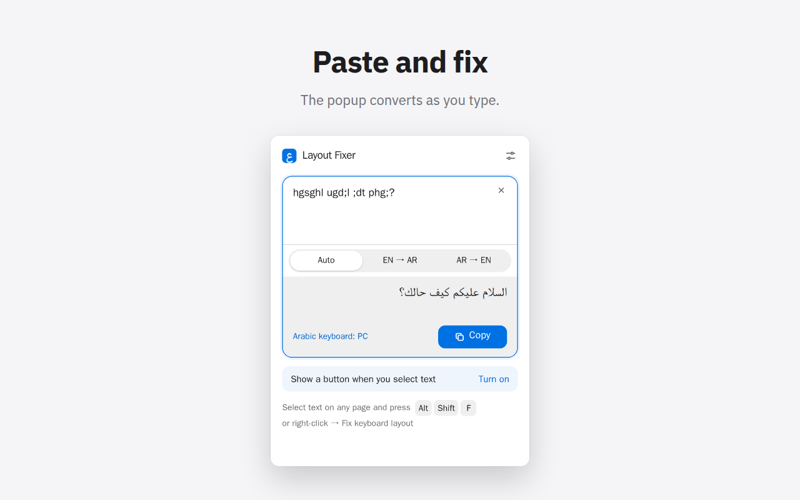
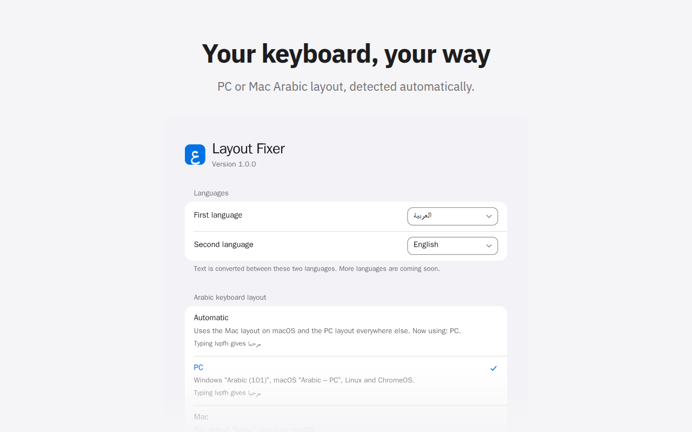
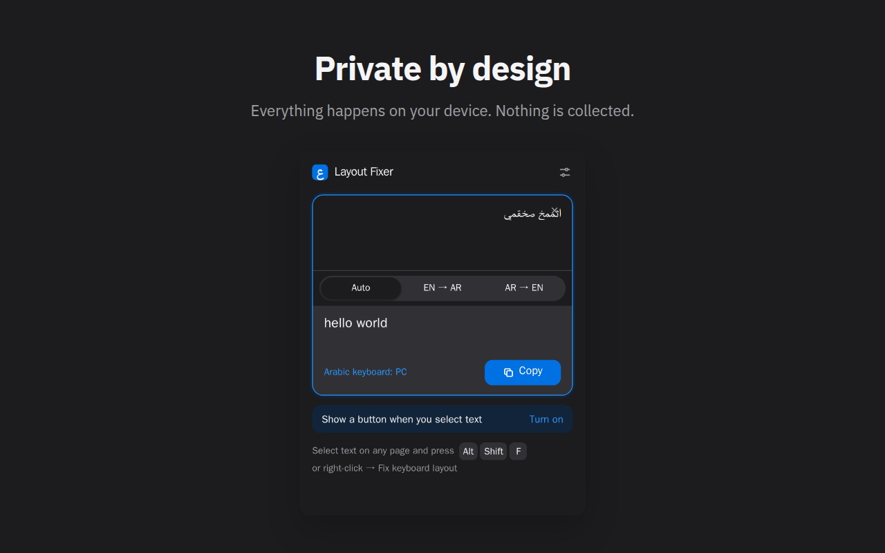
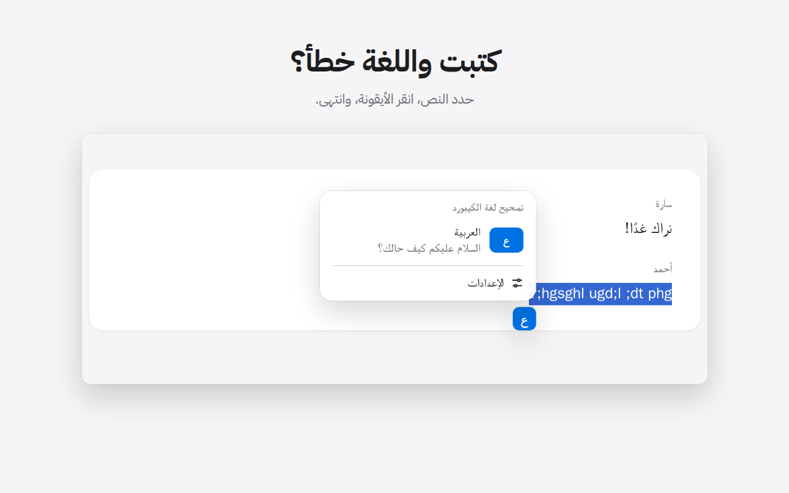
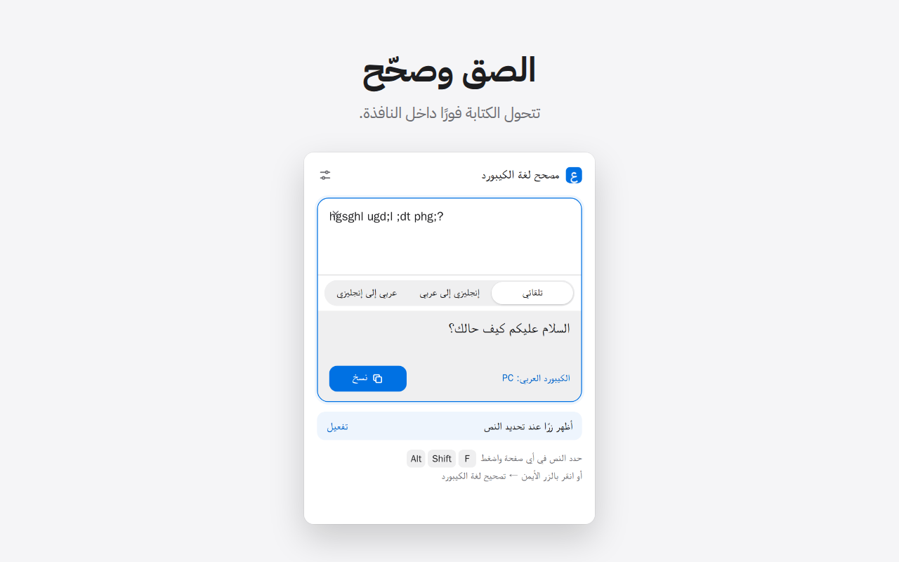

<div align="center">


# Layout Fixer

**Fix text typed with the wrong keyboard layout — Arabic ⇄ English — in one keystroke.**

[](https://github.com/BugsBountyHunter/layout-fixer/actions/workflows/ci.yml)
[](https://github.com/BugsBountyHunter/layout-fixer/releases/latest)
[](LICENSE)
[](https://developer.chrome.com/docs/extensions/develop/migrate/what-is-mv3)
[](PRIVACY.md)

[Install](#install) · [Features](#features) · [Screenshots](#screenshots) · [Privacy](#privacy) · [Development](#development) · [Contributing](#contributing)



</div>

## Why

If you type in both Arabic and English, you have done this: typed a whole sentence, looked up,
and found `hgsghl ugd;l` instead of `السلام عليكم`. Normally you delete it, switch the layout and
type it again. Layout Fixer converts it in place instead.

```text
hgsghl ugd;l   →  السلام عليكم
اثممخ          →  hello
```

Select the text and press <kbd>Alt</kbd>+<kbd>Shift</kbd>+<kbd>F</kbd>
(<kbd>⌥</kbd><kbd>⇧</kbd><kbd>F</kbd> on macOS), or right-click → **Fix keyboard layout**.

## Install

| Browser | How |
| --- | --- |
| Chrome, Edge, Brave, Opera, Vivaldi | Chrome Web Store listing coming soon. Until then: download `layout-fixer-chrome-<version>.zip` from the [latest release](https://github.com/BugsBountyHunter/layout-fixer/releases/latest), unzip it, open `chrome://extensions`, turn on **Developer mode** and choose **Load unpacked**. |
| Firefox (desktop and Android) | Planned. You can [build it from source](#development) today. |

## Features

- **One shortcut** — fixes the selection, or the whole field when nothing is selected
- **Automatic direction** — Arabic typed on the English layout, or English typed on the Arabic layout
- **Undo** with <kbd>Ctrl</kbd>+<kbd>Z</kbd> / <kbd>⌘</kbd><kbd>Z</kbd> in inputs, text areas and rich editors (Gmail, WhatsApp Web, Slack)
- **Read-only text** (a message you received) is copied and shown instead
- **Popup** with a paste-and-fix box and a direction switch
- **Selection button** (optional, off by default): select text, click the icon, pick the language
- **Your keyboard** — PC or Mac Arabic layout, detected automatically
- **English and Arabic interface**, light and dark mode, keyboard and touch friendly

## Screenshots

<table>
  <tr>
    <td width="50%"></td>
    <td width="50%"></td>
  </tr>
  <tr>
    <td align="center"><b>Selection button</b> — select, click, done</td>
    <td align="center"><b>Popup</b> — paste and fix</td>
  </tr>
  <tr>
    <td width="50%"></td>
    <td width="50%"></td>
  </tr>
  <tr>
    <td align="center"><b>Settings</b> — PC or Mac Arabic layout</td>
    <td align="center"><b>Dark mode</b> — and nothing leaves your device</td>
  </tr>
</table>

<details>
<summary>Arabic interface (واجهة عربية)</summary>
<br>
<table>
  <tr>
    <td width="50%"></td>
    <td width="50%"></td>
  </tr>
</table>
</details>

## Supported platforms

| Browser | Windows | macOS | Linux | ChromeOS | Android |
| --- | :---: | :---: | :---: | :---: | :---: |
| Chrome, Edge, Brave, Opera, Vivaldi | ✓ | ✓ | ✓ | ✓ | — |
| Firefox 140+ (142+ on Android) | ✓ | ✓ | ✓ | — | ✓ |
| Safari | planned | planned | — | — | — |

Firefox for Android has no keyboard shortcuts or context menus, so the popup is the way in there.

## Privacy

Everything runs on your device. Layout Fixer makes no network requests, collects no data and has
no analytics. It needs no site access at install; the optional selection button asks for it only
when you turn it on. No extension files are exposed to websites, so pages can't detect it.
Details: [PRIVACY.md](PRIVACY.md).

## How it works

Every layout maps physical keys (`KeyQ`, `Semicolon`, …) to the characters they produce. To fix
text, Layout Fixer finds the key each character came from on one layout and types that key on the
other. Layouts are generated from real OS keyboard data (Windows 101, macOS "Arabic" and
"Arabic – PC", Linux XKB) and verified by tests, never edited by hand. Architecture notes are in
[CLAUDE.md](CLAUDE.md).

## Development

Requires Node.js 20+ (see [`.nvmrc`](.nvmrc)).

```bash
npm install
npm run dev            # Chromium dev build → load dist/chrome as an unpacked extension
npm run dev:firefox    # Firefox → about:debugging → Load Temporary Add-on → dist/firefox/manifest.json
npm run lint           # Biome lint + format check (lint:fix applies fixes)
npm run check          # lint, typecheck, builds, unit tests + coverage, Firefox lint, end-to-end tests
```

- Manual testing: `npm run playground` opens a test page; follow [docs/testing/manual-checklist.md](docs/testing/manual-checklist.md).
- The first end-to-end run needs the Playwright browser: `npx playwright install chromium`.
- Store images: `npm run store:screenshots` (needs Docker). The README uses them too; `docs/images/hero.png` is a crop of `02-shortcut.png`.

### Project structure

```text
src/
├── core/         # converter and keyboard layouts (pure, no DOM)
├── platform/     # shortcuts, OS detection, i18n, validated settings
├── background/   # context menu and shortcut handlers
├── content/      # in-page replacement, toast, selection button
├── popup/        # toolbar popup (React)
├── options/      # settings page (React)
└── ui/           # design tokens, theme, icons, shared components
e2e/              # Playwright tests against the built extension
```

## Release

Bump the version and add a [CHANGELOG.md](CHANGELOG.md) entry in a pull request, then tag `main`:

```bash
git tag v1.0.0 && git push origin v1.0.0
```

The release workflow runs every check and publishes a GitHub Release with the Chrome package.
Store texts and permission justifications are in [docs/store/listing.md](docs/store/listing.md).

## Roadmap

- Smart detection: offer to fix a word that isn't a real word in either language
- More layouts: Persian, Urdu, Hebrew, Russian
- Firefox Add-ons and Edge Add-ons listings
- Safari (macOS and iOS)

## Contributing

Bug reports, layout requests and pull requests are welcome — see [CONTRIBUTING.md](CONTRIBUTING.md)
and the [Code of Conduct](CODE_OF_CONDUCT.md). Please report security issues privately as
described in [SECURITY.md](SECURITY.md).

## Credits

Interface font: the system font on each platform (SF Pro / SF Arabic on Apple devices). The icon
glyph is drawn with [IBM Plex Sans Arabic](https://github.com/IBM/plex) (SIL Open Font License 1.1).
Design system: [docs/design-system.md](docs/design-system.md).

## License

[MIT](LICENSE) © 2026 BugsBountyHunter
